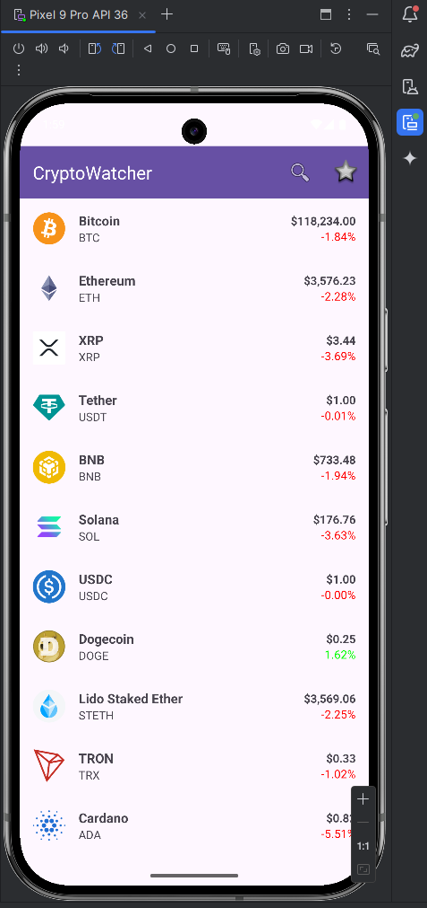
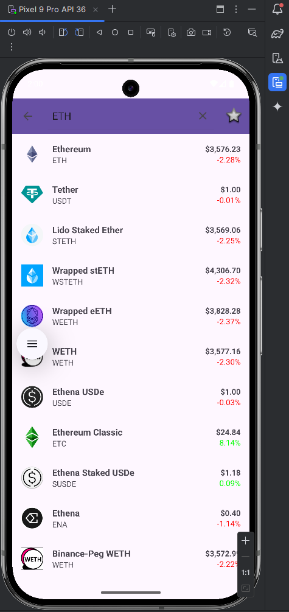
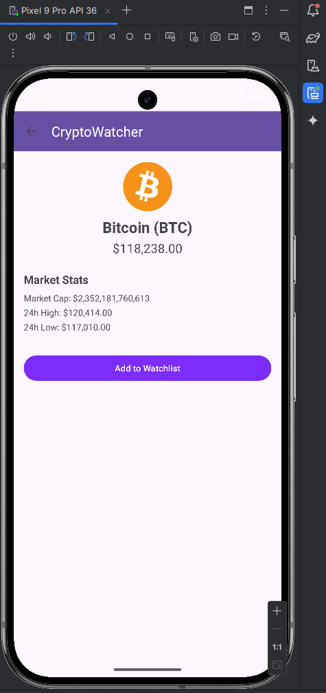
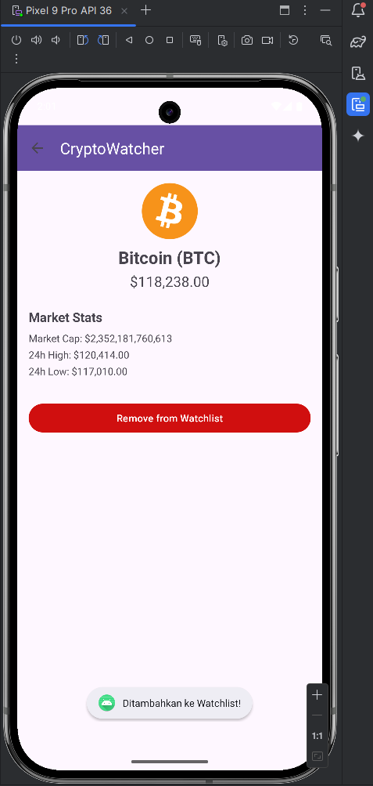
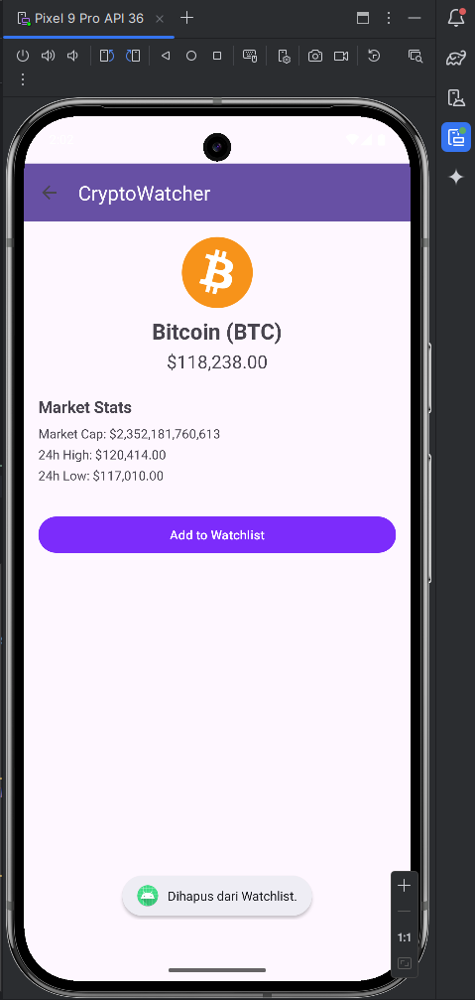
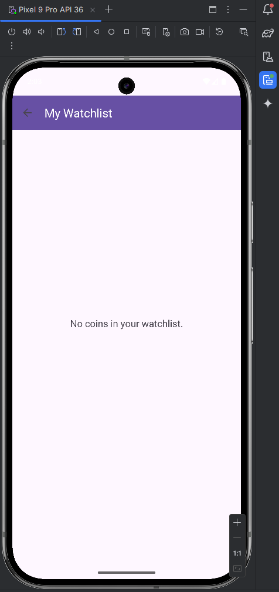
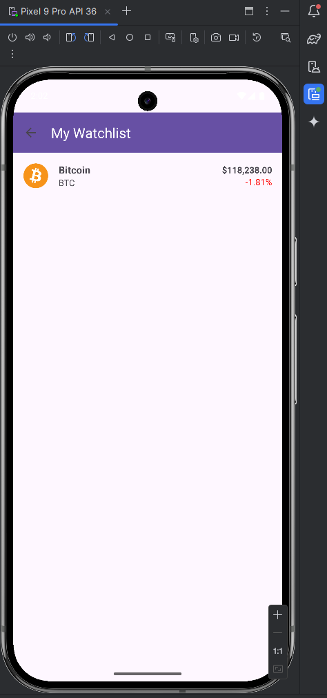

# Dokumentasi Proyek Aplikasi CryptoWatcher

Dokumentasi ini menjelaskan fitur, teknologi, dan mekanisme teknis dari aplikasi Android "CryptoWatcher" yang dibuat sebagai Proyek Akhir Semester (UAS).

## Fitur Utama Aplikasi

Aplikasi ini memiliki beberapa fitur inti yang memungkinkan pengguna untuk memantau harga mata uang kripto:

1.  **Daftar Harga Real-time**: Menampilkan daftar 100 mata uang kripto teratas berdasarkan kapitalisasi pasar, lengkap dengan harga terkini, logo, dan persentase perubahan dalam 24 jam.
2.  **Halaman Detail Koin**: Menyajikan informasi lebih rinci tentang koin yang dipilih, termasuk kapitalisasi pasar, serta harga tertinggi dan terendah dalam 24 jam.
3.  **Fitur Watchlist (Favorit)**: Pengguna dapat menambahkan atau menghapus koin dari daftar pantauan pribadi. Data watchlist disimpan secara lokal di perangkat.
4.  **Database Lokal**: Menggunakan **SQLite** untuk menyimpan data watchlist, sehingga daftar favorit pengguna tidak hilang meskipun aplikasi ditutup.
5.  **Fitur Pencarian**: Memungkinkan pengguna untuk mencari koin secara cepat berdasarkan nama atau simbol dari daftar yang sudah dimuat.
6.  **Keamanan API Key**: API key tidak disimpan secara langsung di dalam kode, melainkan diamankan melalui `build.gradle` dan `local.properties` untuk mencegah pencurian.

---

## Teknologi yang Digunakan

* **Bahasa Pemrograman**: Java
* **Platform**: Android
* **Networking**: Retrofit (untuk komunikasi dengan API)
* **Data Parsing**: GSON (untuk mengubah data JSON dari API menjadi objek Java)
* **Image Loading**: Glide (untuk memuat gambar logo koin dari URL)
* **Database**: SQLite (untuk penyimpanan data lokal)

---

## Cara Setup Proyek

Berikut adalah langkah-langkah yang diperlukan untuk men-setup dan menjalankan proyek ini di Android Studio.

### Prasyarat

Pastikan perangkatmu sudah ter-install:
* **Android Studio** (Disarankan versi Hedgehog atau yang lebih baru)
* **Git** (untuk meng-clone repositori)
* **Android Emulator** atau perangkat fisik dengan **API level 24 (Android 7.0 Nougat)** atau lebih tinggi.

### Langkah-langkah Instalasi

1.  **Clone Repositori**
    Buka terminal atau command prompt, lalu jalankan perintah berikut untuk mengunduh proyek dari GitHub:
    ```bash
    git clone [https://github.com/yusufwdn/CryptoWatcher.git](https://github.com/yusufwdn/CryptoWatcher.git)
    ```

2.  **Buka Proyek di Android Studio**
    * Buka Android Studio.
    * Pilih **Open** atau **Open an Existing Project**.
    * Arahkan ke folder proyek yang baru saja kamu clone, lalu klik **OK**.
    * Tunggu hingga Android Studio selesai melakukan proses *Gradle Sync*.

3.  **Dapatkan API Key dari CoinGecko**
    Aplikasi ini membutuhkan API key gratis dari CoinGecko untuk bisa mengambil data.
    * Buka situs **[CoinGecko API](https://www.coingecko.com/en/api)**.
    * Klik **"Get your free API key"** dan daftar akun jika belum punya.
    * Setelah masuk ke *Dashboard*, buat API key baru.

4.  **Konfigurasi API Key (Langkah Paling Penting)**
    Karena alasan keamanan, API key tidak disimpan di dalam repositori. Kamu harus membuatnya secara manual.
    * Di dalam direktori utama proyek di Android Studio, cari file bernama **`local.properties`**.
    * Jika file tersebut tidak ada, klik kanan pada direktori root proyek -> **New** -> **File**. Beri nama **`local.properties`**.
    * Buka file `local.properties` tersebut dan tambahkan baris berikut, ganti `KEY_COINGECKO` dengan API key yang sudah kamu dapatkan dari CoinGecko.
    ```properties
    # File ini untuk menyimpan data sensitif lokal
    cgApiKey=KEY_COINGECKO
    ```
    Contoh: `cgApiKey=CG-xxxxxxxxxxxxxxxxxxxxxxxxxxxx`
    
    Langkah ini sangat penting karena file `build.gradle.kts` dikonfigurasi untuk membaca key dari file ini. Tanpa langkah ini, aplikasi tidak akan bisa berjalan.

5.  **Build dan Jalankan Aplikasi**
    * Setelah API key dikonfigurasi, klik tombol **Run 'app'** (ikon panah hijau) di Android Studio.
    * Pilih emulator atau perangkat fisik yang tersedia.
    * Aplikasi akan di-build dan di-install secara otomatis.

---

## Mekanisme Kode

Bagian ini menjelaskan beberapa mekanisme teknis kunci di dalam aplikasi dengan menyertakan contoh potongan kode.

### 1\. Konfigurasi dan Pemanggilan API

Komunikasi dengan API CoinGecko dilakukan menggunakan library Retrofit.

* **Interface `ApiService`**: Bertindak sebagai "kontrak" yang mendefinisikan endpoint API mana saja yang akan diakses. Anotasi seperti `@GET`, `@Query`, `@Path`, dan `@Header` digunakan untuk mengonfigurasi *request* HTTP.

    **Contoh Kode:**
    ````java
    // network/ApiService.java
    public interface ApiService {
        // Melakukan GET HTTP ke endpoint "coins/markets"
        // Hasilnya akan mendapatkan list coins dari CoinGecko
        @GET("coins/markets")
        Call<List<Coin>> getMarkets(
            // Menambahkan query parameters pada request
            @Query("vs_currency") String currency,
            @Query("per_page") int perPage,
            @Query("page") int page,

            // @Header menambahkan API Key yang kita miliki ke header request
            @Header("x-cg-demo-api-key") String apiKey
        );
    
        // Melakukan GET HTTP ke endpoint "coins/{id}"
        // Endpoint ini digunakan untuk mengambil detail satu koin berdasarkan ID
        @GET("coins/{id}")
        Call<CoinDetail> getCoinDetail(
            // Menambahkan path parameter coinId
            @Path("id") String coinId,

            // @Header menambahkan API Key yang kita miliki ke header request
            @Header("x-cg-demo-api-key") String apiKey
        );
    }
    ````

* **`RetrofitClient`**: Sebuah *singleton* class yang bertanggung jawab untuk membuat dan mengelola instance dari Retrofit, memastikan efisiensi. `GsonConverterFactory` ditambahkan untuk secara otomatis mengubah response JSON menjadi objek-objek Java.

    **Contoh Kode:**
    ````java
    // network/RetrofitClient.java
    public static ApiService getApiService() {
        if (retrofit == null) {
            // HttpLoggingInterceptor digunakan untuk menampilkan log dari request dan response API
            HttpLoggingInterceptor logging = new HttpLoggingInterceptor();
            logging.setLevel(HttpLoggingInterceptor.Level.BODY);
            OkHttpClient client = new OkHttpClient.Builder()
                    .addInterceptor(logging)
                    .build();

            // Membangun instance Retrofit
            retrofit = new Retrofit.Builder()
                    .baseUrl(BASE_URL) // Set base URL dari CoinGecko
                    .client(client) // Set client dengan tambahan logging interceptor
                    .addConverterFactory(GsonConverterFactory.create()) // Set GSON sebagai converter
                    .build();
        }
        // Membuat implementasi dari ApiService interface
        return retrofit.create(ApiService.class);
    }
    ````

### 2\. Pembuatan Tabel SQLite

Database lokal dan tabel untuk menyimpan data watchlist dibuat menggunakan class `SQLiteOpenHelper`.

* **`WatchlistContract`**: Class ini mendefinisikan konstanta-konstanta untuk nama tabel dan nama kolom untuk membantu dalam menghindari *typo* dan menjaga konsistensi.

    **Contoh Kode:**
    ````java
    // db/WatchlistContract.java
    public final class WatchlistContract {
        // Menghindari instansiasi kelas
        private WatchlistContract() {}

        // Inner class untuk table watchlist
        // Mengimplementasikan BaseColumn agar otomatis tabel memiliki kolom _ID
        public static class WatchlistEntry implements BaseColumns {
            public static final String TABLE_NAME = "watchlist";
            public static final String COLUMN_NAME_COIN_ID = "coin_id";
            public static final String COLUMN_NAME_COIN_NAME = "coin_name";
            public static final String COLUMN_NAME_COIN_SYMBOL = "coin_symbol";
            public static final String COLUMN_NAME_IMAGE_URL = "image_url";
        }
    }
    ````

* **`WatchlistDbHelper`**: Class ini merupakan *helper class* untuk mengelola pembuatan dan *upgrade* database SQLite. Method `onCreate()` dipanggil oleh sistem hanya jika database belum ada.

    **Contoh Kode:**
    ````java
    // db/WatchlistDbHelper.java
    public class WatchlistDbHelper extends SQLiteOpenHelper {
        private static final String SQL_CREATE_ENTRIES =
            "CREATE TABLE " + WatchlistContract.WatchlistEntry.TABLE_NAME + "(" +
                    WatchlistContract.WatchlistEntry._ID + " INTEGER PRIMARY KEY," +
                    WatchlistContract.WatchlistEntry.COLUMN_NAME_COIN_ID + " TEXT UNIQUE," +
                    WatchlistContract.WatchlistEntry.COLUMN_NAME_COIN_NAME + " TEXT," +
                    WatchlistContract.WatchlistEntry.COLUMN_NAME_COIN_SYMBOL + " TEXT," +
                    WatchlistContract.WatchlistEntry.COLUMN_NAME_IMAGE_URL + " TEXT)";
    
        @Override
        public void onCreate(SQLiteDatabase db) {
            db.execSQL(SQL_CREATE_ENTRIES);
        }
        // ...
    }
    ````

### 3\. Proses CRUD di SQLite

* **Create (Menambah Koin)**: Menggunakan `db.insert()` dengan `ContentValues` untuk memasukkan data baru ke tabel.

    **Contoh Kode:**
    ````java
    // DetailActivity.java
    private void addToWatchlist() {
        if (currentCoin == null) return;

        SQLiteDatabase db = dbHelper.getWritableDatabase();
        ContentValues values = new ContentValues();
        values.put(WatchlistContract.WatchlistEntry.COLUMN_NAME_COIN_ID, currentCoin.getId());
        values.put(WatchlistContract.WatchlistEntry.COLUMN_NAME_COIN_NAME, currentCoin.getName());
        values.put(WatchlistContract.WatchlistEntry.COLUMN_NAME_COIN_SYMBOL, currentCoin.getSymbol());
        values.put(WatchlistContract.WatchlistEntry.COLUMN_NAME_IMAGE_URL, currentCoin.getImage().getLarge());

        long newRowId = db.insert(WatchlistContract.WatchlistEntry.TABLE_NAME, null, values);
        db.close();

        if (newRowId != -1) {
            Toast.makeText(this, "Ditambahkan ke Watchlist!", Toast.LENGTH_SHORT).show();
            isInWatchlist = true;
            updateWatchlistButton();
        } else {
            Toast.makeText(this, "Gagal menambahkan.", Toast.LENGTH_SHORT).show();
        }
    }
    ````

* **Read (Mengecek Status Koin)**: Menggunakan `db.query()` untuk mengambil data. Aplikasi mengecek status satu koin di halaman detail.

    **Contoh Kode:**
    ````java
    // DetailActivity.java
    private void checkWatchlistStatus() {
        SQLiteDatabase db = dbHelper.getReadableDatabase();
        String selection = WatchlistContract.WatchlistEntry.COLUMN_NAME_COIN_ID + " = ? ";
        String[] selectionArgs = { coinId };

        Cursor cursor = db.query(
            WatchlistContract.WatchlistEntry.TABLE_NAME,   // Nama tabel
            null,                                          // Kolom yang ingin diambil (null = semua)
            selection,                                     // Kolom untuk klausa WHERE
            selectionArgs,                                 // Nilai untuk klausa WHERE
            null, null, null
        );

        isInWatchlist = cursor.getCount() > 0;
        cursor.close();
        db.close();

        // update tampilan tombol berdasarkan statusnya
        updateWatchlistButton();
    }
    ````

* **Delete (Menghapus Koin)**: Menggunakan `db.delete()` dengan klausa `WHERE` berdasarkan `coinId` untuk menghapus data.

    **Contoh Kode:**
    ````java
    // DetailActivity.java
    private void removeFromWatchlist() {
        SQLiteDatabase db = dbHelper.getWritableDatabase();
        String selection = WatchlistContract.WatchlistEntry.COLUMN_NAME_COIN_ID + " = ?";
        String[] selectionArgs = { coinId };

        int deletedRows = db.delete(WatchlistContract.WatchlistEntry.TABLE_NAME, selection, selectionArgs);
        db.close();

        if (deletedRows > 0) {
            Toast.makeText(this, "Dihapus dari Watchlist.", Toast.LENGTH_SHORT).show();
            isInWatchlist = false;
            updateWatchlistButton();
        } else {
            Toast.makeText(this, "Gagal menghapus.", Toast.LENGTH_SHORT).show();
        }
    }
    ````

### 4\. Mekanisme Tampilan Watchlist

Halaman `WatchlistActivity` menampilkan daftar koin yang ada di watchlist pengguna dengan harga terbaru.

1.  **Ambil ID dari Database**: Aplikasi pertama-tama mengambil *hanya* daftar ID koin dari tabel watchlist di SQLite.
2.  **Gabungkan ID**: Daftar ID tersebut (`["bitcoin", "ethereum", ...]`) diubah menjadi satu string yang dipisahkan koma (`"bitcoin,ethereum,..."`).
3.  **Panggil API**: String ID tersebut digunakan untuk memanggil endpoint `/coins/markets` dengan parameter `ids` untuk mendapatkan data pasar terbaru *hanya* untuk koin-koin tersebut.
4.  **Tampilkan di RecyclerView**: Data terbaru dari API kemudian ditampilkan menggunakan `CoinAdapter` yang sama dengan halaman utama.

Semua kodenya ada di dalam `WatchlistActivity.java`.

## Screenshot Halaman Aplikasi

### Halaman Utama (List Data)


### Halaman Utama (List Data dengan Pencarian)


### Halaman Detail Crypto


### Halaman Detail Crypto (Tambah Watchlist)


### Halaman Detail Crypto (Hapus Watchlist)


### Halaman Watchlist (Tanpa Data)


### Halaman Watchlist (Dengan Data)
